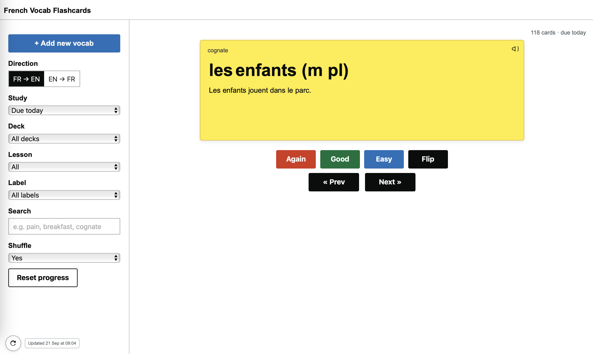

# French Vocab Flashcards

A lightweight, mobile-friendly flashcard app for practising French vocabulary. It pulls your cards from a Google Sheet (fed by a Google Form), schedules reviews with a simple spaced-repetition loop, and runs as a static site (e.g. GitHub Pages). No server required.




## Objectives
	•	Study vocab “due today” using a light spaced-repetition cycle.
	•	Switch direction: French → English or English → French.
	•	Add new vocab easily via a Google Form.
	•	Keep all progress stored locally so multiple learners don’t interfere.
	•	Run anywhere with nothing more than a browser.


## How to Use the App

### Controls
	•	**Direction** – Choose which side of the card appears first (FR→EN or EN→FR).
	•	Study – Show only cards “Due today” or all matching filters.
	•	Deck – Filter by deck/category (e.g., Food, Family, Classroom).
	•	Lesson – Narrow by lesson number or name.
	•	Label – Filter by special labels (e.g., cognate).
	•	Search – Free text search across French, English, sentences, labels, and tags.
	•	Shuffle – Shuffle the order of the current set.
	•	Reset progress – Clear your learning history for this data source.

### Cards
	•	Front/Back – Shows French or English depending on the direction.
	•	Sentence – Hidden on the French side until tapped; always shown on the French back.
	•	Labels – Small text marker (e.g., cognate).
	•	Tags – Optional keyword markers.
	•	Forvo link – Appears on the French side, opens pronunciation page in a new tab.

### Actions
	•	Again / Good / Easy – Grades your recall and schedules the next review.
	•	Flip – Show the reverse side of the card.
	•	Prev / Next – Move through the filtered set.

### Refresh
	•	Bottom-left of the screen:
	•	A refresh button to reload the sheet data.
	•	A “last updated” timestamp so you know when the data was last fetched.

### Shortcuts (desktop)
	•	Space – Flip
	•	Left / Right arrows – Prev / Next
	•	1 or A – Again
	•	2 or G – Good
	•	3 or E – Easy


## Data Model (Google Sheet)

The app expects a header row with these columns (case insensitive):
	•	deck – e.g., Food, Family, Classroom
	•	lesson – number or text
	•	article – le, la, l’, les
	•	french – the word itself
	•	english – translation
	•	sentence – optional short sentence
	•	labels – optional label (supports multiple with commas/semicolons/pipes)
	•	tags – optional keywords
	•	id – optional unique ID (if not present, app generates)
	•	pron – optional (reserved for future use)

Other columns such as Timestamp (from the Form) are ignored.


## Scheduling

Each card is assigned a “box” (1–5) with days until next review:
	•	Box 1 → 0 days
	•	Box 2 → 1 day
	•	Box 3 → 2 days
	•	Box 4 → 4 days
	•	Box 5 → 7 days

Actions adjust the box:
	•	Again = reset to 1
	•	Good = +1 box (max 5)
	•	Easy = +2 boxes (max 5)

Progress is stored in localStorage in the browser, keyed by the data source URL.

⸻

## Architecture

### Data flow
	1.	Add vocab with the Google Form.
	2.	Responses land in the Google Sheet (Form responses tab).
	3.	Google Apps Script publishes the sheet as a CSV endpoint.
	4.	The app fetches that CSV (via AllOrigins to handle CORS).
	5.	Cards are rendered, filtered, and scheduled locally.

### Files
	•	index.html – layout and structure
	•	css/style.css – styles, including mobile adjustments
	•	js/app.js – logic for fetching, rendering, filtering, scheduling

⸻

## Setup & Configuration
	•	Google Form – inputs vocab directly to the sheet.
	•	Google Sheet – holds the Form responses tab.
	•	Apps Script – publishes a web app endpoint for CSV export.
	•	GitHub Pages (or any static host) – serves the HTML/CSS/JS.

In app.js, configure:
```javascript
const SHEET_ENDPOINT = "https://script.google.com/macros/s/…/exec?sheet=Form%20responses";
const DEFAULT_SRC = "https://api.allorigins.win/raw?url=" + encodeURIComponent(SHEET_ENDPOINT);
```
Update if your script URL or sheet name changes.

## Mobile Use
	•	Hamburger menu opens filters.
	•	Large, touch-friendly buttons.
	•	Refresh button and “last updated” timestamp always visible.
	•	Add to Home Screen on iOS/Android for an app-like experience.
